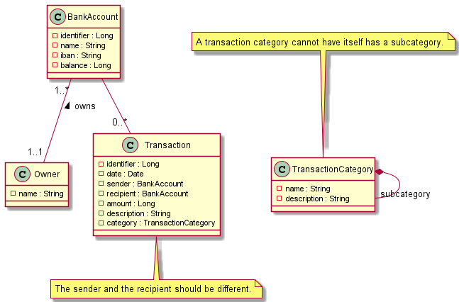
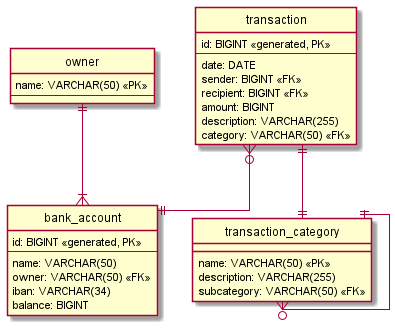

# Data model
## Class diagram

## Entity relationship diagram

## Details
### Owner

- Name (ID)
  - Type: String.
  - Constraints: Required, unique, not blank.
  - Description: This identifies a bank account owner.

### Bank account

- Identifier (ID)
  - Type: Long.
  - Constraints: Required, unique.
  - Description: This is a generated sequential identifier.

- Name
    - Type: String.
    - Constraints: Required, not blank.
    - Description: This is a human-readable name for the bank account. It may depict its usage, e.g. checking account.

- Owner
  - Type: String.
  - Constraints: Required, this is a foreign key to an owner.
  - Description: This is the bank account owner.
    
- IBAN
  - Type: String.
  - Constraints: Optional, not blank, [IBAN standard](https://www.iban.com/structure) check.
  - Description: This is a generated sequential identifier.

- Balance
  - Type: Long.
  - Constraints: Optional, it should not be specified on external accounts.
  - Description: This is the amount of Euros available on this account.

### Transaction

- Identifier (ID)
    - Type: Long.
    - Constraints: Required, unique.
    - Description: This is a generated sequential identifier.

- Date
  - Type: Date.
  - Constraints: Required.
  - Description: This is the date of the day that the transaction took place in. Time is not relevant.

- Sender bank account
    - Type: Long.
    - Constraints: Required. This is a foreign key to a bank account identifier.
    - Description: This is the bank account that was debited.

- Recipient bank account
    - Type: Long.
    - Constraints: Required. This is a foreign key to a bank account identifier.
    - Description: This is the bank account that was credited.

- Amount
    - Type: Long.
    - Constraints: Required.
    - Description: This is the amount of Euros that wad transferred.

- Description
    - Type: String.
    - Constraints: Optional.
    - Description: This can be used to describe what is the transaction about. This could support markdown.

- Category
  - Type: String.
  - Constraints: Required, this is a foreign key to a transaction category.
  - Description: This identifies a transaction category.

### Transaction Category

- Name
  - Type: String.
  - Constraints: Required, unique, not blank.
  - Description: This identifies a transaction category.

- Description
    - Type: String.
    - Constraints: Optional.
    - Description: This can be used to describe what is the category about. This could support markdown.

- Subcategory
    - Type: String.
    - Constraints: Optional, this is a foreign key to another category.
    - Description: This identifies a transaction subcategory.